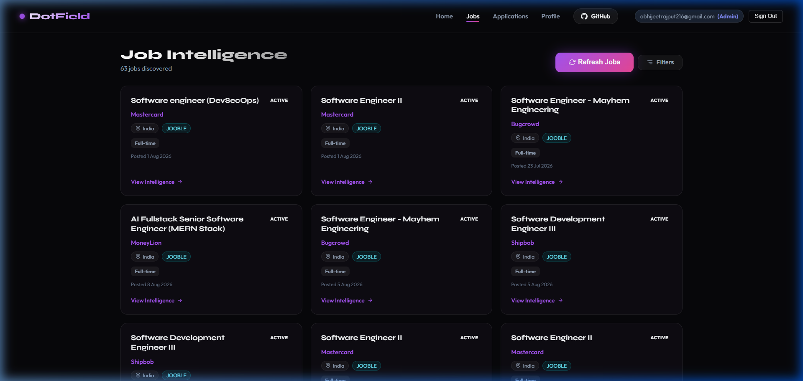
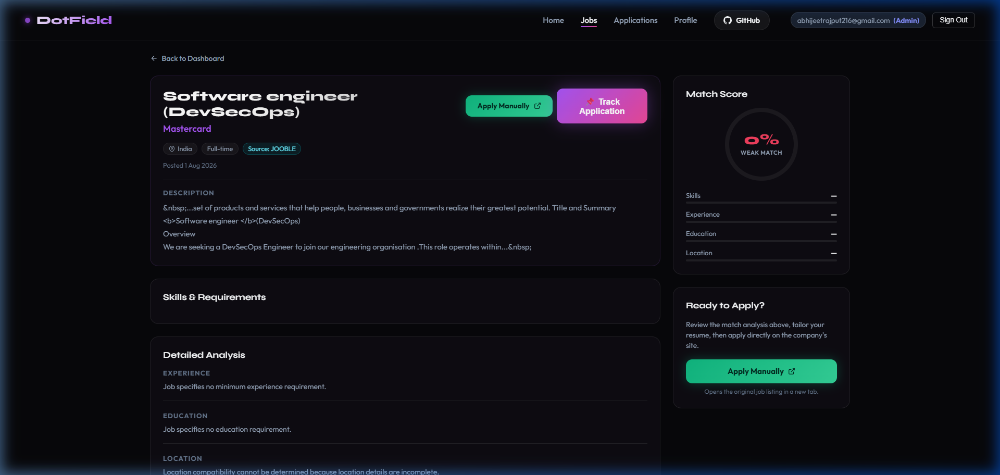
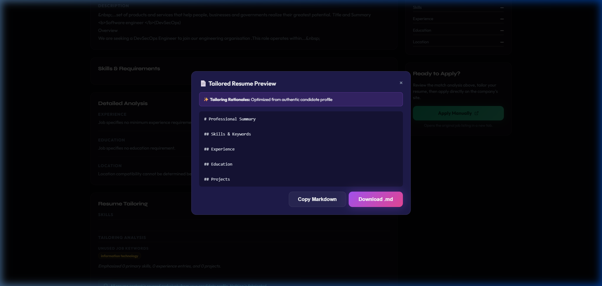
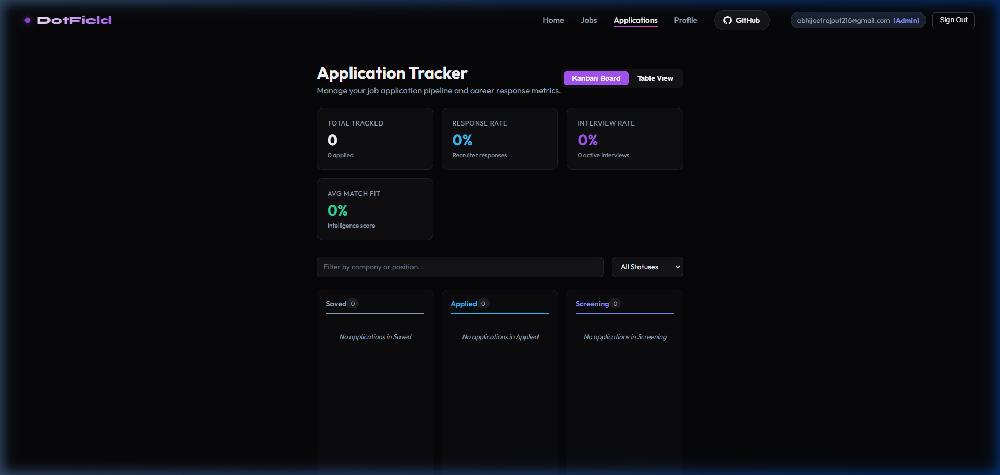
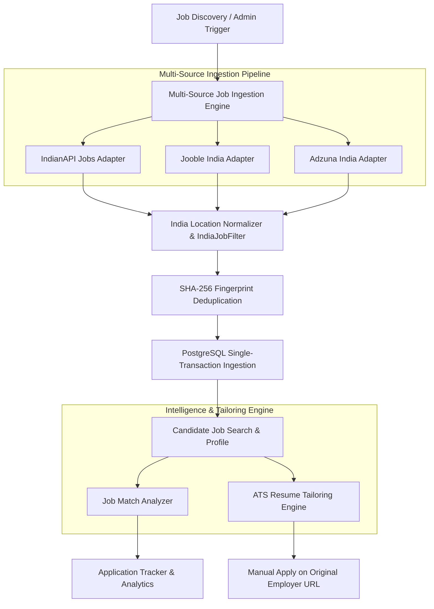

# DOT Field — Job Intelligence Platform

[](https://dot-field.vercel.app)
[](https://youtu.be/example-demo)
[](https://github.com/abhijeet-rx/Dot-field-)

**Live Application**: [https://dot-field.vercel.app](https://dot-field.vercel.app)  
**GitHub Repository**: [https://github.com/abhijeet-rx/Dot-field-](https://github.com/abhijeet-rx/Dot-field-)

**DOT Field** is an automated, production-grade **India-first multi-source job discovery, requirement analysis, candidate fit matching, and AI resume tailoring platform**.

The application combines a high-throughput **multi-source ingestion pipeline** (integrating IndianAPI Jobs, Jooble, and Adzuna India APIs) with **deterministic location normalization**, **atomic cross-source deduplication**, **candidate skill/experience scoring**, and **ATS resume tailoring engines** to empower Indian job seekers and recruiters with real-time job market intelligence while preserving privacy and manual application workflows.

> [!IMPORTANT]
> **Application Disclaimer**: DOT Field does not automatically apply to jobs without user intent. Candidates manually apply through the original employer job listing URL.

---

## Key Features

- **India-First Multi-Source Job Discovery**: Ingests real-time job listings from verified Indian job API providers (IndianAPI Jobs, Jooble India, and Adzuna India).
- **Deterministic India Location Normalization & Filtering**:
  - Normalizes 35+ major Indian tech hubs & tier-1/tier-2 cities (Bengaluru, Hyderabad, Pune, Mumbai, Delhi NCR, Gurugram, Noida, Chennai, etc.).
  - Explicitly validates India-remote roles (`"Remote - India"`, `"India - Remote"`, `"Remote (India)"`) while rejecting generic unanchored remote listings and foreign locations (`"London, UK"`, `"San Francisco, USA"`).
- **Atomic Cross-Source Deduplication**: SHA-256 fingerprint hashing and partial unique indexes (`Flyway V6`) prevent duplicate job listings across different job providers.
- **Candidate Profile & Requirement Matching**: Scores job fit across 4 weighted dimensions:
  - **Skill Overlap (40%)**: Direct match ratio of mandatory, preferred, and bonus technical skills.
  - **Experience Relevance (30%)**: Verified total and domain-specific calendar experience alignment.
  - **Title & Domain Fit (20%)**: Keyword hierarchy and role responsibility alignment.
  - **Location & Contract Fit (10%)**: Remote preferences, city proximity, and employment type.
- **ATS Resume Tailoring Engine**: Generates customized, ATS-friendly resumes per job opportunity, highlighting relevant keywords, prior achievements, and structured summary sections.
- **Application Tracking & Funnel Analytics**: Interactive Kanban and table boards tracking job application statuses (`SAVED`, `APPLIED`, `INTERVIEW`, `OFFER`, `REJECTED`) with real-time conversion metrics.
- **Permanent Security & RBAC Isolation**: Multi-role security (`USER` vs `ADMIN`) powered by BCrypt password hashing, HS256 JWT tokens, and automated idempotent admin provisioning (`INITIAL_ADMIN_EMAIL`).
- **Production-Hardened Rate Limiting**: Per-client Bucket4j rate limiting protecting discovery, ingestion, and authentication endpoints against brute force and quota exhaustion.

---

## Application Screenshots

### 1. Job Intelligence Dashboard & Ingestion Hub


### 2. Candidate Job Fit & Requirements Analyzer


### 3. Tailored Resume Generator


### 4. Application Tracker & Analytics


---

## Application Workflow



---

## Scoring Methodology

Jobs are evaluated against authentic candidate profiles across four weighted dimensions. The scoring criteria strictly match the backend implementation in `JobMatchingService.java`:

| Dimension | Weight | Description |
| :--- | :---: | :--- |
| **Skill Overlap** | **40%** | Direct match ratio of candidate skills vs required, preferred, and bonus job skills. |
| **Experience Relevance** | **30%** | Exact calendar duration of relevant candidate experience vs. target job requirement. |
| **Title & Domain Fit** | **20%** | Structural title keyword alignment and role domain overlap. |
| **Location & Contract Fit** | **10%** | Location proximity (Indian tech hub), remote type preference, and employment contract. |

$$\text{Final Fit Score} = (0.40 \times \text{Skill}) + (0.30 \times \text{Experience}) + (0.20 \times \text{Title}) + (0.10 \times \text{Location})$$

---

## Technology Stack

### Client-Side (Frontend)
- **Framework**: React 19 + Vite 8
- **Styling**: Vanilla CSS3 (Glassmorphism, Vibrant Dark Mode, Micro-animations)
- **Icons**: Lucide React 1.33
- **Routing**: React Router DOM 7
- **HTTP Client**: Native Fetch API with auto Bearer JWT injection & 401 handling

### Server-Side (Backend)
- **Language**: Java 21 (OpenJDK / Eclipse Temurin)
- **API Framework**: Spring Boot 3.4.1 (Spring Web, Spring Validation)
- **Security Framework**: Spring Security 6, JJWT 0.12.6, BCrypt Password Hashing
- **Rate Limiting**: Bucket4j 8.10.1 (In-Memory Bounded LRU Token Buckets)

### Real Job API Providers
- **IndianAPI Jobs**: REST API (`jobs.indianapi.in`)
- **Jooble**: REST API (`jooble.org/api`)
- **Adzuna India**: REST API (`api.adzuna.com` `co=in`)

### Database & ORM
- **Database**: PostgreSQL 15+ (Production/Dev) / H2 (In-Memory Unit Testing)
- **Migration & ORM**: Flyway DB 10+ (Migrations V1–V7) & Spring Data JPA / Hibernate 6

---

## Project Structure

```text
Dot-field-/
├── dot-field-backend/
│   ├── src/main/java/com/dotfield/
│   │   ├── config/             # SecurityConfig, CorsConfig, AdminBootstrapInitializer
│   │   ├── controller/         # REST Controllers (AuthController, JobController, ApplicationController, HealthController)
│   │   ├── discovery/          # Multi-source job discovery engine:
│   │   │   ├── india/          # IndiaJobFilter & IndiaLocationNormalizer
│   │   │   ├── source/         # IndianApiJobSource, JoobleJobSource, AdzunaJobSource
│   │   │   └── JobDiscoveryService.java
│   │   ├── dto/                # Pydantic-like Java DTOs & ApiResponse envelopes
│   │   ├── entity/             # JPA Entities (User, Profile, Job, Application)
│   │   ├── exception/          # GlobalExceptionHandler & ApiError
│   │   ├── repository/         # Spring Data JPA Repositories
│   │   ├── security/           # JwtService, JwtAuthenticationFilter, DiscoveryRateLimitFilter
│   │   ├── service/            # Core business logic (AuthService, JobService, ApplicationService)
│   │   └── tailoring/          # ATS Resume Tailoring Engine & Prioritizers
│   ├── src/main/resources/
│   │   ├── db/migration/       # Flyway SQL migrations (V1__baseline to V7__india_relevance)
│   │   └── application.properties
│   ├── src/test/java/          # JUnit 5 test suite (450+ unit & integration test cases)
│   ├── Dockerfile              # Multi-stage Java 21 Dockerfile
│   ├── pom.xml                 # Maven build configuration
│   └── .env.example
├── src/                        # React Frontend
│   ├── api/                    # API client helper (client.js)
│   ├── components/             # React UI components (Navbar, JobCard, Modal)
│   ├── pages/                  # Application pages (JobIntelligence, Profile, Applications)
│   └── index.css               # Design system variables & glassmorphic tokens
├── public/                     # Static assets & screenshots
├── package.json                # Frontend Node dependencies
├── vite.config.js              # Vite build configuration
└── README.md
```

---

## Setup & Installation

### Prerequisites
- **Java**: `21` (JDK)
- **Node.js**: `18+`
- **PostgreSQL**: `14+`
- **API Keys**: IndianAPI Key, Jooble API Key, Adzuna App ID & Key

---

### 1. Backend Setup

```bash
cd dot-field-backend

# Copy environment template
cp .env.example .env
```

Edit `dot-field-backend/.env` with your local database and API credentials:
```ini
DB_URL=jdbc:postgresql://localhost:5432/dot_field
DB_USERNAME=postgres
DB_PASSWORD=your_postgres_password

JWT_SECRET=your_secure_random_256bit_key_at_least_32_characters
INITIAL_ADMIN_EMAIL=admin@example.com

INDIANAPI_KEY=your_indianapi_key
JOOBLE_API_KEY=your_jooble_api_key
ADZUNA_APP_ID=your_adzuna_app_id
ADZUNA_APP_KEY=your_adzuna_app_key
```

Start the Spring Boot backend server:
```bash
# Windows (PowerShell):
.\mvnw.cmd spring-boot:run

# macOS/Linux:
./mvnw spring-boot:run
```
- API Base Endpoint: `http://localhost:8080/api`
- Health Check Endpoint: `http://localhost:8080/api/health`

---

### 2. Frontend Setup

In a new terminal tab from the root directory:
```bash
# Install Node dependencies
npm install

# Start Vite development server
npm run dev
```
- Frontend Application: `http://localhost:5173`

---

## Running Automated Tests

The backend includes a JUnit 5 test suite covering authorization, JWT validation, admin provisioning, pagination bounds, rate limiting, India filtering, deduplication, and end-to-end workflow flows:

```bash
cd dot-field-backend
.\mvnw.cmd clean test
```

Expected output:
```text
[INFO] Tests run: 450, Failures: 0, Errors: 0, Skipped: 3
[INFO] BUILD SUCCESS
```

---

## API Reference Overview

| Method | Endpoint | Access Level | Description |
| :--- | :--- | :--- | :--- |
| `GET` | `/api/health` | `Public` | Database & application health probe |
| `POST` | `/api/auth/register` | `Public` | Register candidate account (Assigns `ADMIN` if email matches `INITIAL_ADMIN_EMAIL`) |
| `POST` | `/api/auth/login` | `Public` | Authenticate user & return HS256 Bearer JWT token |
| `GET` | `/api/auth/me` | `Authenticated` | Get current logged-in user profile & role |
| `GET` | `/api/jobs` | `Authenticated` | Search & filter jobs (`page`, `size`, `company`, `remoteType`, `employmentType`) |
| `GET` | `/api/jobs/{id}` | `Authenticated` | Get detailed job opportunity info |
| `GET` | `/api/jobs/{id}/match` | `Authenticated` | Compute 4-dimension fit score & match breakdown for profile |
| `GET` | `/api/jobs/{id}/resume/tailor` | `Authenticated` | Generate tailored ATS resume markdown for job |
| `POST` | `/api/jobs/discover` | `ADMIN Only` | Trigger live multi-source job discovery & ingestion run |
| `GET` | `/api/jobs/ingestion/status` | `ADMIN Only` | Get ingestion metrics (sources, fetched, filtered, deduplicated) |
| `GET` | `/api/applications` | `Authenticated` | List user tracked job applications |
| `POST` | `/api/applications` | `Authenticated` | Track a job application (`SAVED`, `APPLIED`, `INTERVIEW`, etc.) |
| `GET` | `/api/applications/analytics` | `Authenticated` | Retrieve application funnel metrics & conversion stats |

---

## Security & Performance Highlights

- **Security & Authorization**: Strict RBAC (`USER` vs `ADMIN`) enforced via Spring Security 6.
- **HS256 JWT Hardening**: Mandatory secret key validation (>= 32 bytes) preventing algorithm confusion.
- **Bucket4j Rate Limiting**: User-keyed / safe IP-keyed token buckets protecting auth and discovery endpoints.
- **Trusted Proxy IP Safety**: Evaluates `X-Forwarded-For` header ONLY if `rate.limiter.trusted-proxy.enabled=true`.
- **Atomic Deduplication**: Flyway V6 partial unique index on `deduplication_fingerprint` preventing race conditions during parallel ingestion.
- **Zero-Secret Exposure**: Strict `.gitignore` rules preventing `.env` or API credentials from entering Git history or client bundles.

---

## Author

Developed by **Abhijeet Singh**  
VIT-AP University  
GitHub Repository: [DOT Field Platform](https://github.com/abhijeet-rx/Dot-field-)

---
